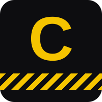

<p align="center">
  
</p>

<p align="center">
  <a href="https://github.com/uncoalesced/cordon/actions/workflows/ci.yml"></a>
  <a href="LICENSE"></a>
  
  
  
  <a href="docs/stage1-design.md"></a>
</p>

Cordon watches what an AI coding agent does at the level of individual tool calls, not the
container as a whole. To most resource controllers, a `pytest` run and a `git status` both look
like "a subprocess." Cordon tells them apart, because one of those needs 500MB and the other
needs 13MB, and no single container-wide limit serves both well. Set the limit for the test
suite and the `git status` wastes almost all of it. Set it for the `git status` and the test
suite gets OOM-killed mid-run, taking whatever the agent had already reasoned its way to with it.

It measures first, then acts on what it measures. Measurement hooks into Claude Code, Codex CLI,
Hermes Agent, Cursor CLI, or Gemini CLI — Aider too, though at a coarser grain, since Aider has
no hook system to attach to — and tracks memory and CPU per tool call rather than per container.
Enforcement runs each guarded call in its own short-lived cgroup, sized from what the agent says
it's about to do, and talks back when a limit actually bites. The enforcement path works on any
Linux with cgroup v2 today; the part of it that would react at kernel speed instead of userspace
speed is still waiting on kernel features that don't exist outside an RFC yet — more on that
below, stated plainly rather than glossed over.

Grounded in [AgentCgroup](https://arxiv.org/abs/2602.09345) and
[AgentSight](https://arxiv.org/abs/2508.02736) — both read in full for this build, not
summarized from an abstract.

## How Cordon works

### Watching a session without touching the agent's code

Claude Code, Codex CLI, and Gemini CLI each fire a `PreToolUse`-and-`PostToolUse`-shaped pair of
events around every tool call, and hand a JSON payload to whatever command is registered against
them: `session_id`, `cwd`, `tool_name`, `tool_input`, and on the post side, `tool_response`.
Cursor and Hermes do the same thing under different event names and slightly different field
names. Cordon registers `cordon hook` against all of them and normalizes the differences through
one alias table (`features/wrapper/agents.py`) rather than shipping five separate integrations.

The alternative was patching each framework's tool-use loop directly, and it was rejected on
purpose. That approach breaks on every release of every agent it targets, and it's the exact
mistake AgentSight's "boundary tracing" argument warns about: instrument at a boundary the agent
can't route around, not inside internals that churn out from under you. The hook interface is
that boundary. It also means porting Cordon to a sixth agent is one new set of event-name aliases,
not a rewrite of the sampler or the reducer underneath it.

### One sampler per session, not one per tool call

An obvious first design spawns a sampling process around each tool call and tears it down when
the call ends. Cordon doesn't do that. It starts one background sampler for the whole session, on
the first hook firing, and lets the hooks themselves write cheap timestamped markers that get
joined against the sample stream afterward.

Three reasons. Spawning a process inside `PreToolUse` costs on the order of 100ms on Windows, and
that cost lands directly inside the window being measured — it would inflate exactly the numbers
this exists to produce. Second, the idle time between tool calls is data, not waste: the framework
baseline memory and the reasoning-versus-execution time split only show up if something is
sampling between calls too. Third, attributing bursts to tool calls at all needs both streams at
once — a per-call sampler throws away the denominator that makes "tool calls contain most of the
bursts" a measurable claim instead of an assertion.

The sampler walks up from the hook's own process to find the agent's root (`claude.exe` on
Windows, `hermes`, `codex`, `cursor-agent`, `gemini`, or `aider` elsewhere), then polls memory and
CPU across that process's entire tree every 250ms — RSS summed across every descendant for
memory, per-process CPU percent summed the same way, so a fully loaded 8-core box reads as 800%.
250ms instead of a full second because the bursts this is meant to catch last 1–2 seconds and can
change at multiple gigabytes per second; at a 1-second interval you'd get one or two samples per
burst and the recorded peak would depend on when the sampler happened to land. On the reference
Windows dev machine, against a live 10–11 process Claude Code tree, one sampling tick runs a
6.82ms median (8.82ms p95, 11.18ms max) — almost entirely the cost of rescanning the process
table — which works out to roughly 2.73% of one core at the 250ms interval. Re-measure this on
your own machine before trusting a characterization batch; it's the floor on how much Cordon
disturbs the thing it's watching, and it scales with total system process count, not with the
size of the tree you actually care about.

Everything lands in two append-only files per session, `runs/<session-id>/markers.jsonl` and
`samples.jsonl`, kept separate because they have different producers and different failure modes:
a crashed sampler shouldn't cost you the marker log, and a hook that never fires shouldn't corrupt
the sample stream.

### Turning two streams into one record per tool call

`cordon reduce` joins markers to samples and writes `toolcalls.jsonl`, one record per tool call
carrying start and end time, peak and average memory, average CPU, and the raw per-tick samples
for that call's window — kept raw rather than collapsed to just the aggregates, because later
analysis needs to look at how a burst is *shaped*, not only how big it got.

Pairing a start marker to its end isn't always as clean as it sounds. Not every agent's hook
payload carries a stable tool-call ID across every version, so Cordon prefers `tool_use_id` when
it's present and falls back to a key built from `session_id + tool_name + canonical(tool_input)`,
matching starts to ends last-in-first-out per key. That's exact for the ordinary case and
degrades only on genuine concurrent duplicates — the same tool invoked with byte-identical input
twice at once, which is rare but not impossible. Rather than guess through that case silently,
the reducer counts it: `unpaired_starts` and `orphan_ends` show up in the run summary so
contamination is visible instead of quietly averaged away.

### Five characterization passes

`cordon analyze` loads every reduced run under a directory and runs it through five passes —
execution-time split, peak-to-average memory ratio, per-tool-type breakdown, retry-loop
detection, and CPU/memory correlation — plus two burst measures the raw sample stream makes
possible, then renders a report that states a measured-versus-paper verdict for each one.

Two of those passes rest on a judgment call worth stating rather than hiding. Baseline memory is
the *10th percentile of the whole session's samples*, not the median of samples falling outside
tool-call windows — the window-complement definition breaks exactly on the sessions that matter
most, since a session dominated by bursty tool calls poisons its own baseline with the bursts
it's supposed to be measured against. A low quantile is the resting floor by construction and
needs no window bookkeeping to get there. And a retry group is defined as *three or more strictly
consecutive calls* of the same tool with a byte-identical command — matching how the source paper
defines it, at the cost of undercounting the common real-world pattern where a failing `pytest`
alternates with a `Read` or an `Edit` in between. `retry_profile` takes an `ignore_tools` argument
that relaxes this; the strict version stays the default so the number stays comparable to the
paper's own.

The report is careful to distinguish "measured zero" from "not measurable" — a dataset with no
Bash calls at all reports no data for the Bash share, and a dataset with Bash calls but no test
commands reports an honest 0%. Collapsing those two into one number is how a report ends up
claiming a divergence it never actually measured.

Every hook path exits `0` no matter what happens inside it, and every sampling or analysis
failure is logged and skipped rather than raised. A broken measurement must never break the agent
being measured — that's not a nice-to-have, it's the one rule this whole layer isn't allowed to
break.

### Acting on what it finds

Enforcement runs one guarded command inside a single ephemeral cgroup, named `tool_<pid>_<unix
timestamp>`, created immediately before the subprocess spawns and torn down immediately after it
exits — on success, on failure, on timeout, and on a `KeyboardInterrupt`. The child attaches to
its own cgroup before `exec` runs (via `preexec_fn` on POSIX), because attaching from the parent
afterward would lose whatever the process allocated between fork and that write — on a burst
measured at multiple gigabytes per second, that's exactly the part worth catching.

Limits come from what the agent says it's about to do. Setting `AGENT_RESOURCE_HINT=memory:high`
before a call resolves to a `memory.high` soft limit and a `cpu.weight` for that call alone, with
`medium` as the default when nothing is declared, so an undeclared call is neither privileged nor
punished:

| Tier | Fraction of installed RAM | On 16GB | `cpu.weight` |
|---|---|---|---|
| `low` | 2.5% | 410 MB | 25 |
| `medium` (default) | 10% | 1.6 GB | 100 |
| `high` | 35% | 5.7 GB | 400 |
| `max` | unlimited (`memory.high=max`) | — | 1000 |

Every tier is floored at 256MB so a small machine can't wedge itself, and parsing is deliberately
forgiving of how a language model actually writes these things — `memory:`, `mem:`, and `ram:` are
all accepted, a bare `high` reads as a memory tier, dimensions combine (`memory:high,cpu:low`),
and an unrecognized token gets logged and skipped instead of failing the tool call over a typo.
An absolute value like `memory:2G` is accepted too, for a caller that genuinely knows the number —
a benchmark replaying a fixed trace, say — though it's recorded with `memory_tier="absolute"` so
it's visibly distinct in the logs from a tier the agent actually chose.

Hints are advisory, never trusted blindly: crossing a `memory.high` limit throttles the process
under memory pressure, it doesn't kill it. Only `memory.high` gets set — never `memory.max` — for
the same reason the source paper argues against hard limits in the first place: an OOM kill
destroys whatever context the agent had already built up, and killing the wrong subprocess is a
worse outcome than letting it run slow. `memory.oom.group` is set regardless, so if the *system*
OOM killer ever does fire on a guarded call, it takes the whole cgroup atomically instead of
leaving a half-killed process tree behind.

Feedback runs the other way. A call whose cumulative memory stall — read from `memory.pressure`'s
PSI accounting, not from an event counter, since PSI gives a duration and a counter only gives a
crossing count — exceeds `max(200ms, 5% of that call's own wall time)` gets a plain-language note
appended to its stderr once it exits, so the agent sees it on its next turn instead of failing
silently:

> `[cordon]` This tool call was resource-limited. It peaked at 1842.0 MB against a memory:medium
> limit of 1638.4 MB. It stalled 1.50s (54% of its 2.8s runtime) waiting on memory. Consider
> narrowing the scope of this command. If it genuinely needs more, set
> `AGENT_RESOURCE_HINT=memory:high` before retrying.

The 200ms floor sits comfortably above both the source paper's own measured per-allocation stalls
(tens of milliseconds) and Cordon's own instrumentation cost, so the threshold can't trip on the
measurement itself; the 5% term keeps the message proportional across call lengths that range from
a four-second `Read` to a hundred-second sub-agent delegation. A freeze or an OOM kill is always
reported, no threshold involved, because those are state changes the agent has to know about, not
degrees of slowness. And repeats escalate rather than repeat verbatim — from the third warning on
the same exact command, the message adds a line saying retrying it unchanged is unlikely to help,
because that's precisely the moment a retry loop needs to hear something different, not the same
sentence again.

Run `cordon control probe` before any of this to see what your machine can actually do. It checks
for Linux itself, the capability bits needed to touch cgroups, cgroup v2 with the `cpu` and
`memory` controllers delegated and writable, PSI memory-pressure accounting, and `sched_ext`
availability — and reports each one honestly rather than assuming. On a machine without a working
cgroup v2 mount, guarded commands still run; Cordon logs what it would have applied and enforces
nothing, so a laptop without root access still gets a usable dry run.

### What isn't built yet, and why that's stated instead of hidden

The cgroup v2 interfaces above — `memory.high`, `cpu.weight`, `cgroup.freeze`, `cgroup.kill`,
`memory.oom.group`, PSI stall accounting — are all ordinary Linux, available on any modern kernel
without a patch. What's missing is the layer that would move the actual throttle *decision* from
a userspace loop (tens of milliseconds per round trip) into the kernel itself (microseconds) —
the difference that matters against bursts lasting one to two seconds. That needs `sched_ext` for
CPU policy, which requires Linux 6.12+ with `CONFIG_SCHED_CLASS_EXT`, and a not-yet-upstream
`memcg_bpf_ops` RFC for memory policy, which as of this writing has landed nowhere but
`bpf-next`. Neither is stubbed, mocked, or faked into looking done — `cordon control probe`
reports both as absent on a machine that lacks them, and says so.

Two more things are deliberately absent rather than merely unfinished. There's no automatic
freeze-escalation loop above the throttle: `freeze()` and `thaw()` exist on the cgroup backend,
but nothing calls them on a schedule, because a userspace loop that polls pressure and decides
when to freeze is just a rebuild of `oomd` — the exact thing the responsiveness argument above
says is too slow. Building that anyway just to have something to demo before the kernel layer
arrives would be building the wrong system on purpose. And there's no BPF program and no
`scx_flatcg` fork in this repo yet, because there's nothing on the reference machine to attach
either to, and code written against a kernel that isn't there is guesswork, not preparation.

## Install

```
python -m venv .venv
.venv\Scripts\python.exe -m pip install -e ".[dev]"
```

## Setup

Claude Code, Codex CLI, Hermes Agent, Cursor CLI, and Gemini CLI each shipped their own hook
system, and all five turned out to be a renamed copy of the same idea: matcher-and-command
groups, JSON piped to a script on stdin carrying `tool_name` / `tool_input` / `session_id` /
`cwd`, exit code `2` (or a decision field, depending on the agent) to block. `cordon hook` speaks
every one of those dialects through a single alias table instead of a separate binary per agent.
Aider has no hook system at all, so it gets a different command entirely — see its section below.

Every subsection below is independent. Install hooks for whichever agents you actually run; there's
no requirement to set up all five.

### Claude Code

```
.venv\Scripts\cordon.exe install-hooks --target C:\path\to\task-repo --write
```

This is the default agent — `--agent claude-code` is implied if you leave it off. Drop `--write`
first if you want to see the merged `.claude\settings.json` before anything on disk actually
changes; the command prints a dry-run preview and tells you to add `--write` when you're ready.
Hooks fire on `SessionStart`, `PreToolUse`, `PostToolUse`, and `SessionEnd`, all routed to
`cordon hook`.

### Codex CLI

```
.venv\Scripts\cordon.exe install-hooks --target C:\path\to\task-repo --agent codex --write
```

Writes `.codex\hooks.json` under the same four event names Claude Code uses, and separately
patches `.codex\config.toml` to add `codex_hooks = true` under a `[features]` table — hooks are
still an opt-in, actively developed Codex feature and ship off by default. Codex additionally
refuses to run a hook it hasn't reviewed: run `/hooks` once inside Codex to see what got
registered and trust it. This is the newest hook surface of the five covered here and the most
likely to have moved since this was written, so it's worth confirming hooks actually fire on
whatever Codex version you're running before trusting the data that comes out of it.

### Hermes Agent

```
.venv\Scripts\cordon.exe install-hooks --agent hermes --write
```

`--target` is ignored for Hermes on purpose: its hooks live in `~/.hermes/config.yaml`, a
user-global file rather than a per-repo one. Set `CORDON_HERMES_HOME` to point somewhere else if
you want to test against an isolated config instead of your real one. Hermes fires
`on_session_start`, `pre_tool_call`, `post_tool_call`, and `on_session_end`, and — like Codex —
won't run a freshly registered hook without a one-time approval: run `hermes hooks` to trust it,
unless `hooks_auto_accept: true` is already set in your config, which Cordon will never set on
your behalf.

### Cursor CLI / Cursor Agent

If you've already installed Claude Code hooks in a repo, Cursor can load that exact
`.claude\settings.json` instead of needing a second config file: turn on *Settings → Rules,
Skills, Subagents → Include third-party Plugins, Skills, and other configs*, and the Claude Code
install above is all you need — skip the command below entirely. Otherwise, Cursor wants its own
file:

```
.venv\Scripts\cordon.exe install-hooks --target C:\path\to\task-repo --agent cursor --write
```

This writes `.cursor\hooks.json` in Cursor's own shape, covering `sessionStart`, `preToolUse`,
`postToolUse`, `postToolUseFailure`, and `sessionEnd`.

### Gemini CLI

```
.venv\Scripts\cordon.exe install-hooks --target C:\path\to\task-repo --agent gemini --write
```

Writes `.gemini\settings.json` against `SessionStart`, `BeforeTool`, `AfterTool`, and
`SessionEnd` — Gemini CLI's own event names, different from the four every other nested-hook
agent above happens to share. Hooks are on by default from v0.26.0 onward, no separate trust step
needed. One thing worth checking before you rely on this: Google has said Gemini CLI is being
superseded by Antigravity CLI for unpaid-tier and Google One users, so confirm which CLI you're
actually running before pointing `--agent gemini` at it.

### Aider (and anything else without a hook system)

Aider doesn't have a `PreToolUse`/`PostToolUse`-shaped hook system, because there's no moment in
its architecture between "the agent decides to act" and "the action runs" for a hook to attach
to. `cordon wrap` covers that case a different way: it spawns the agent itself as a direct child
process and samples that exact PID for the whole run, producing one session-level peak/average
memory-and-CPU record instead of a per-tool-call breakdown.

```
.venv\Scripts\cordon.exe wrap -- aider --message "fix the failing test"
```

`cordon reduce` still works on a wrapped run and reports `n_toolcalls: 0` — that's expected, not
a bug, since there are no per-call markers to pair. `cordon analyze`'s per-tool breakdown and
retry-loop passes need those paired markers to mean anything, so treat wrap-only data as
session-level only.

## Measure

Run the agent normally with hooks installed. Cordon writes a marker log and a sample stream per
session under `runs\<session-id>\`. Once the session ends, reduce it into one record per tool
call:

```
.venv\Scripts\cordon.exe reduce --run-dir runs\<session-id>
```

Once you've reduced a batch of sessions, characterize the whole set against the source papers'
published numbers:

```
.venv\Scripts\cordon.exe analyze --runs runs --out docs\stage1-findings.md
```

Pass `--json` instead of `--out` if you want the raw numbers rather than the rendered report.

## Control

Check what the machine can actually enforce before trusting any of this:

```
.venv\Scripts\cordon.exe control probe
```

Run one command inside its own per-call cgroup, with a declared hint:

```
.venv\Scripts\cordon.exe control run --hint memory:high -- pytest tests/
```

The guarded command's exit code passes through unchanged either way. On a machine without a
working cgroup v2 mount, the command still runs — Cordon logs what it would have applied and
enforces nothing, rather than failing the call outright.

Measure what enforcement is actually worth under synthetic CPU contention — the same
unguarded-versus-guarded shape the source paper's own evaluation uses:

```
.venv\Scripts\cordon.exe control contend --out docs\stage2-contention.md
```

## Layout

```
assets/              logo, banner, social preview — see docs/design-language.md
features/wrapper/   sampler, hook entrypoint, reducer, JSON-lines schema, agent registry, wrap
features/analysis/  characterization passes over reduced tool-call records
features/control/   capability probe, intent protocol, cgroup backends, guarded runner
docs/                design notes and findings
tests/                pytest suite
```

## Identity

<p>
  
</p>

Cordon's visual identity is cordon tape: black ground, hazard-amber stripe. The name picked the
palette, not the other way around — the whole project is about drawing a boundary around a
subprocess and deciding what's allowed to cross it, which is what a cordon does. `assets/mark.svg`
above is the 200×200 monogram, the source for the repo's avatar and favicon.
`assets/social-preview.png` is the 1280×640 composition GitHub wants for link previews; it isn't
embedded here because GitHub doesn't pick one up from the README automatically — upload it once
by hand at **Settings → General → Social preview**. Full palette, type, and badge conventions are
in `docs/design-language.md`.

## Docs

- `docs/stage1-design.md` — why interception happens through hooks rather than a fork, why
  sampling runs as one continuous process per session instead of one per call, the measured
  instrumentation overhead, and the two judgment calls behind the characterization passes.
- `docs/stage1-findings.md` — measured results against the source papers' numbers, generated by
  `cordon analyze`. Holds methodology and known structural differences today; the results table
  fills in once a real task batch has been run.
- `docs/stage2-design.md` — the environment-gating table for what this machine can and can't
  enforce, why the intent protocol uses tiers instead of raw byte counts, the exact feedback
  threshold and why that number, and what was deliberately left unbuilt while the kernel layer
  is gated.
- `docs/design-language.md` — the visual identity: palette, type, asset usage, badge markup, and
  the GitHub topics/description to set for discoverability.

## License

MIT. See [LICENSE](LICENSE).
