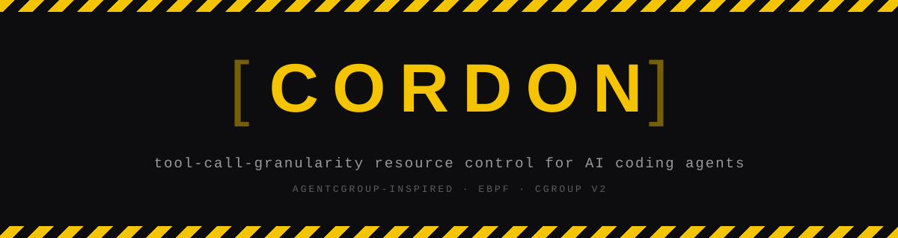

<p align="center">
  
</p>


<p align="center">
  <a href="https://github.com/uncoalesced/cordon/actions/workflows/ci.yml"></a>
  <a href="LICENSE"></a>
  
  
  
  <a href="docs/stage1-design.md"></a>
</p>


Cordon watches what an AI coding agent does at the level of individual tool calls, not the
container as a whole. To most resource controllers, a `pytest` run and a `git status` both look
like "a subprocess." Cordon tells them apart, because one needs 500MB and the other needs 13MB,
and no single container-wide limit serves both well.

It measures first, then acts on what it measures. Measurement hooks into Claude Code, Codex CLI,
Hermes Agent, Cursor CLI, or Gemini CLI (Aider too, at a coarser grain) and tracks memory and CPU
per tool call. Enforcement runs each guarded call in its own short-lived cgroup, sized from what
the agent says it's about to do, and talks back when a limit actually bites. The enforcement path
works on any Linux with cgroup v2 today; the part that would react at kernel speed instead of
userspace speed is still waiting on kernel features that don't exist outside an RFC yet, which is
stated plainly below rather than glossed over.

Grounded in [AgentCgroup](https://arxiv.org/abs/2602.09345) and
[AgentSight](https://arxiv.org/abs/2508.02736).

## How Cordon works

Claude Code, Codex CLI, Gemini CLI, Cursor, and Hermes each fire a `PreToolUse`-and-`PostToolUse`
pair of events around every tool call, with a JSON payload on stdin (`session_id`, `cwd`,
`tool_name`, `tool_input`, and `tool_response` on the post side). Cordon registers `cordon hook`
against all of them and normalizes the differences through one alias table
(`features/wrapper/agents.py`) instead of shipping five separate integrations. This was a
deliberate choice over patching each framework's tool-use loop directly, since that breaks on
every release and instruments internals that churn. Hooks are a stable boundary the agent can't
route around.

On the first hook firing, Cordon starts one background sampler for the whole session rather than
spawning a fresh process per call, and lets the hooks write cheap timestamped markers that get
joined against the sample stream afterward. Spawning a process inside `PreToolUse` costs roughly
100ms on Windows, landing directly inside the window being measured, and the idle time between
calls is data too: the framework's baseline memory and the reasoning-versus-execution split both
depend on sampling between calls, not just during them. The sampler walks up from the hook's own
process to find the agent's root, then polls memory (RSS summed across the whole process tree)
and CPU (per-process percent, summed the same way) every 250ms, since the bursts this is meant to
catch last 1-2 seconds and can change at multiple gigabytes per second. On the reference dev
machine, one sampling tick runs a 6.82ms median against a live 10-11 process Claude Code tree,
roughly 2.73% of one core. Re-measure this on your own machine before trusting a batch; it's the
floor on how much Cordon disturbs what it's watching.

`cordon reduce` joins markers to samples into `toolcalls.jsonl`, one record per tool call with
start/end time, peak and average memory, average CPU, and the raw per-tick samples (kept raw
because later analysis needs to see how a burst is shaped, not just how big it got). Not every
agent's hook payload carries a stable tool-call ID, so pairing falls back to
`session_id + tool_name + canonical(tool_input)`, matched last-in-first-out; the rare case of two
byte-identical concurrent calls gets counted in `unpaired_starts`/`orphan_ends` rather than
guessed at silently.

`cordon analyze` runs the reduced data through five passes (execution-time split,
peak-to-average memory ratio, per-tool breakdown, retry-loop detection, CPU/memory correlation)
plus two burst measures, and renders a report with a measured-versus-paper verdict for each one.
Two judgment calls worth knowing about: baseline memory is the 10th percentile of the session's
samples rather than the median of non-tool-call samples, since a session dominated by bursty
calls would otherwise poison its own baseline. And a retry group is three or more strictly
consecutive identical calls, matching the source paper's definition, which undercounts the
common pattern of a failing `pytest` alternating with a `Read`/`Edit` in between (`retry_profile`
takes an `ignore_tools` argument to relax this).

Every hook path exits `0` no matter what happens internally, and every sampling or analysis
failure is logged and skipped rather than raised. A broken measurement must never break the agent
being measured.

### Acting on what it finds

Enforcement runs one guarded command inside a single ephemeral cgroup (`tool_<pid>_<timestamp>`),
created right before the subprocess spawns and torn down right after it exits. Limits come from
what the agent says it's about to do: setting `AGENT_RESOURCE_HINT=memory:high` before a call
resolves to a `memory.high` soft limit and a `cpu.weight` for that call alone.

| Tier | Fraction of RAM | On 16GB | `cpu.weight` |
|---|---|---|---|
| `low` | 2.5% | 410 MB | 25 |
| `medium` (default) | 10% | 1.6 GB | 100 |
| `high` | 35% | 5.7 GB | 400 |
| `max` | unlimited | — | 1000 |

Hints are advisory, never trusted blindly: crossing `memory.high` throttles under pressure, it
doesn't kill. Only `memory.high` gets set, never `memory.max`, because an OOM kill destroys
whatever context the agent had already built up. A call whose cumulative memory stall (read from
PSI, not an event counter) exceeds `max(200ms, 5% of that call's wall time)` gets a plain-language
note appended to its stderr once it exits:

> `[cordon]` This tool call was resource-limited. It peaked at 1842.0 MB against a memory:medium
> limit of 1638.4 MB. It stalled 1.50s (54% of its 2.8s runtime) waiting on memory. Consider
> narrowing the scope of this command. If it genuinely needs more, set
> `AGENT_RESOURCE_HINT=memory:high` before retrying.

A freeze or OOM kill is always reported regardless of threshold. Repeats escalate rather than
repeat verbatim: from the third warning on the same exact command, the message notes that
retrying it unchanged is unlikely to help.

Run `cordon control probe` first to see what your machine can actually do: Linux, the capability
bits for cgroups, cgroup v2 with `cpu`/`memory` delegated, PSI accounting, and `sched_ext`
availability. On a machine without a working cgroup v2 mount, guarded commands still run; Cordon
logs what it would have applied and enforces nothing.

The cgroup v2 interfaces above are all ordinary Linux, available without a patch. What's missing
is the layer that would move the throttle *decision* into the kernel itself, microseconds instead
of a userspace loop's tens of milliseconds, which is what actually matters against a burst that
lasts a second or two. That needs `sched_ext` (Linux 6.12+) for CPU policy and a not-yet-upstream
`memcg_bpf_ops` RFC for memory policy. Neither is stubbed or faked; `cordon control probe` reports
both as absent on a machine that lacks them. There's also no automatic freeze-escalation loop
above the throttle on purpose, since a userspace loop that polls pressure and decides when to
freeze is just a slower rebuild of `oomd`, the exact thing this design tries to avoid.

## Install

```
python -m venv .venv
.venv\Scripts\python.exe -m pip install -e ".[dev]"
```

## Setup

Claude Code, Codex CLI, Hermes Agent, Cursor CLI, and Gemini CLI each shipped their own hook
system, and all five are a renamed copy of the same idea: matcher-and-command groups, JSON on
stdin, exit code `2` (or a decision field) to block. `cordon hook` speaks all five dialects
through one alias table. Aider has no hook system at all, so it gets a different command. Install
hooks for whichever agents you actually run; there's no need to set up all five.

### Claude Code

```
.venv\Scripts\cordon.exe install-hooks --target C:\path\to\task-repo --write
```

Default agent, `--agent claude-code` is implied. Drop `--write` first to preview the merged
`.claude\settings.json` before anything on disk changes.

### Codex CLI

```
.venv\Scripts\cordon.exe install-hooks --target C:\path\to\task-repo --agent codex --write
```

Writes `.codex\hooks.json` and adds `codex_hooks = true` to `.codex\config.toml`, since hooks are
still opt-in there. Run `/hooks` inside Codex once to trust the newly registered hook. This is the
newest hook surface of the five, so confirm it actually fires on your version before trusting the
data.

### Hermes Agent

```
.venv\Scripts\cordon.exe install-hooks --agent hermes --write
```

`--target` is ignored: Hermes hooks live in `~/.hermes/config.yaml`, a user-global file (set
`CORDON_HERMES_HOME` to point elsewhere). Run `hermes hooks` once to trust the registered hook,
unless `hooks_auto_accept: true` is already set.

### Cursor CLI / Cursor Agent

If you've already installed Claude Code hooks, Cursor can load that same `.claude\settings.json`
directly: enable *Settings → Rules, Skills, Subagents → Include third-party Plugins, Skills, and
other configs*. Otherwise:

```
.venv\Scripts\cordon.exe install-hooks --target C:\path\to\task-repo --agent cursor --write
```

### Gemini CLI

```
.venv\Scripts\cordon.exe install-hooks --target C:\path\to\task-repo --agent gemini --write
```

Hooks are on by default from v0.26.0 onward. Google has said Gemini CLI is being superseded by
Antigravity CLI for unpaid-tier and Google One users, so confirm which one you're running.

### Aider (and anything else without a hook system)

Aider has no `PreToolUse`/`PostToolUse`-shaped hook system, so `cordon wrap` spawns the agent
itself as a direct child and samples that PID for the whole run, giving one session-level
peak/average record instead of a per-tool-call breakdown:

```
.venv\Scripts\cordon.exe wrap -- aider --message "fix the failing test"
```

`cordon reduce` reports `n_toolcalls: 0` on a wrapped run; that's expected. `cordon analyze`'s
per-tool and retry-loop passes need paired markers, so treat wrap-only data as session-level only.

## Measure

Run the agent normally with hooks installed. Cordon writes a marker log and sample stream per
session under `runs\<session-id>\`. Once the session ends:

```
.venv\Scripts\cordon.exe reduce --run-dir runs\<session-id>
```

Then characterize a batch of reduced sessions against the source papers' numbers:

```
.venv\Scripts\cordon.exe analyze --runs runs --out docs\stage1-findings.md
```

Pass `--json` instead of `--out` for raw numbers.

## Control

```
.venv\Scripts\cordon.exe control probe
.venv\Scripts\cordon.exe control run --hint memory:high -- pytest tests/
.venv\Scripts\cordon.exe control contend --out docs\stage2-contention.md
```

`probe` reports what the machine can enforce. `run` guards one command in its own cgroup and
passes its exit code through unchanged; without a working cgroup v2 mount it still runs the
command, just unguarded. `contend` measures what enforcement is worth under synthetic CPU
contention, the same unguarded-vs-guarded shape as the source paper's own evaluation.

## Layout

```
assets/              logo, banner, social preview — see docs/design-language.md
features/wrapper/   sampler, hook entrypoint, reducer, JSON-lines schema, agent registry, wrap
features/analysis/  characterization passes over reduced tool-call records
features/control/   capability probe, intent protocol, cgroup backends, guarded runner
docs/                design notes and findings
tests/                pytest suite
```

## License

MIT. See [LICENSE](LICENSE).
