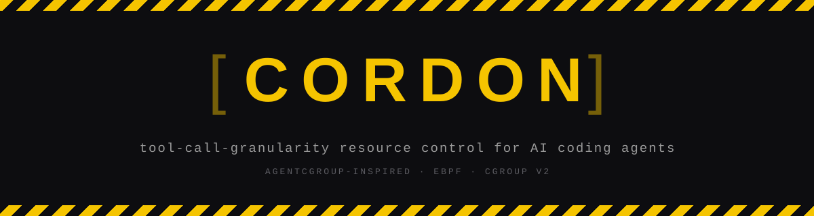

<p align="center">
  
</p>


<p align="center">
  <a href="https://github.com/uncoalesced/cordon/actions/workflows/ci.yml"></a>
  <a href="LICENSE"></a>
  
  
  
  <a href="docs/stage1-design.md"></a>
</p>


Your coding agent runs `pytest` and `git status` a hundred times a session. To the OS they're
both just "a subprocess of node". One wants 500 MB, the other wants 13 MB, and no single limit on
the whole agent fits both.

Cordon looks at each tool call on its own. It hooks into Claude Code, Codex CLI, Gemini CLI,
Cursor and Hermes (Aider too, more coarsely), records memory and CPU for every call, and writes
you a report when the session ends. If you want a limit on a specific command, `cordon control
run` gives it one, sized from what the agent says the command is about to do.

It's grounded in two papers, [AgentCgroup](https://arxiv.org/abs/2602.09345) and
[AgentSight](https://arxiv.org/abs/2508.02736), and every report checks its numbers against them.

## Quick start

```bash
pipx install git+https://github.com/uncoalesced/cordon
cordon install-hooks --scope user --write     # Claude Code, every repo
cordon doctor                                 # is it actually working?
```

Use your agent the way you normally do. After a session:

```bash
cordon report --last
```

`pipx` puts one `cordon` on your PATH and sidesteps the "externally-managed-environment" error
Debian, Ubuntu and Homebrew Python throw at a plain `pip install`. Working on Cordon itself:

```bash
python3 -m venv .venv && .venv/bin/pip install -e ".[dev]"       # Linux, macOS
py -3 -m venv .venv; .venv\Scripts\python.exe -m pip install -e ".[dev]"   # Windows
```

From a checkout, runs go to the repo's `runs/`. From `pipx` or `--scope user`, they go to your
data dir: `~/.local/share/cordon/runs` on Linux (respects `XDG_DATA_HOME`),
`~/Library/Application Support/cordon/runs` on macOS, `%LOCALAPPDATA%\cordon\runs` on Windows.

## What the report tells you

The table you'll look at first is *Heaviest tool calls*. Here's the top of a real one from a
model-training repo. These sessions were recorded before per-process tracking existed, so they
use the fallback: how far the whole tree rose above where it sat just before the call.

| Added (MB) | Measured as | Duration (s) | Tool | Command |
|---|---|---|---|---|
| 1834 | rise over 615 MB | 10.6 | Bash | `python -u train.py --preset parentheses-0.9-300k...` |
| 1684 | rise over 1431 MB | 12.3 | Bash | `python scripts/mqar_eval.py --parity-check` |
| 1528 | rise over 1385 MB | 20.2 | Bash | `python -m model.backbone; python -m model.selective...` |

New sessions say `own N proc(s)` there instead, and that's the number to trust.

"Added" means memory from the processes that call started, and nothing else. That distinction
matters more than I expected when I started. Claude Code itself sits around 1.5 GB while it
works, so a naive "peak memory during the call" makes a `sed -n 1,50p` look like it ate 2 GB.
Cordon records every process born during the session and charges each call only for its own:
the shell, the `python train.py`, the `rg` behind a Grep. A Read or Edit runs inside the agent and
starts nothing, so it costs 0, which is the honest answer.

Below that you get per-tool and per-command-category breakdowns, retry loops (the same failing
command three or more times in a row), how much of the session was tool time versus thinking time,
and a comparison against the papers' numbers.

`cordon status` lists every recorded session with its duration, tool call count, peak memory,
whether it has a report, and whether its sampler is still running. `cordon status --clean` stops
samplers whose agent has gone away.

## Limits, per OS

Installing the hooks doesn't limit anything. They only measure. Limits are opt-in, one command at
a time:

```bash
cordon control probe                                  # what can this machine enforce?
cordon control run --hint memory:high -- pytest tests/
```

What you get depends on the machine. `probe` actually creates and removes a test cgroup before it
claims anything, so it won't tell you a backend works when it doesn't.

| Host | Backend | What it does |
|---|---|---|
| Linux, normal user, systemd | `cgroup2`, under your own `user@UID.service` | real `memory.high` throttling and `cpu.weight`, kernel stall time (PSI) |
| Linux, root or writable cgroupfs | `cgroup2`, at the mount root | the same |
| Linux, only `systemctl --user` works | `systemd-run --user --scope` | the same limits, applied by systemd |
| Linux without usable cgroups (WSL1, proot, locked-down containers) | `advisory` | `nice` for CPU, a memory watchdog that warns |
| macOS | `advisory` | `nice`, plus `taskpolicy -b` for low-priority work, and a memory watchdog |
| Windows | `null` | runs the command untouched and records what it would have applied |

The first row is the one most Linux desktops land on, and it needs no sudo. Earlier versions of
Cordon only tried the cgroup root, which meant nobody without root got real limits.

Hints set the size. `AGENT_RESOURCE_HINT=memory:high` (or `--hint`) picks a tier:

| Tier | Share of RAM | On 16 GB | `cpu.weight` |
|---|---|---|---|
| `low` | 2.5% | 410 MB | 25 |
| `medium` (default) | 10% | 1.6 GB | 100 |
| `high` | 35% | 5.7 GB | 400 |
| `max` | unlimited | n/a | 1000 |

Cordon only ever sets `memory.high`, never `memory.max`. Going over throttles the command, it
doesn't kill it, because an OOM kill throws away whatever the agent had built up. When a limit
actually bites (memory stall above 200 ms or 5% of the call's runtime, whichever is bigger), the
agent gets a note on stderr:

> `[cordon]` This tool call was resource-limited. It peaked at 1842.0 MB against a memory:medium
> limit of 1638.4 MB. It stalled 1.50s (54% of its 2.8s runtime) waiting on memory. Consider
> narrowing the scope of this command. If it genuinely needs more, set
> `AGENT_RESOURCE_HINT=memory:high` before retrying.

From the third warning on the same command, the note also says that retrying it unchanged
probably won't help.

On macOS and cgroup-less Linux there's no kernel throttle to lean on, so the watchdog can only
tell you the command spent N seconds over its limit. The JSON labels that number
`stall_source: watchdog`, so it never gets mistaken for real stall time. I'd rather be clear that
this is soft than pretend it's a hard limit.

What's still missing on Linux: the throttle decision happens in a userspace loop measured in tens
of milliseconds, against bursts that last a second or two. Moving it into the kernel needs
`sched_ext` (Linux 6.12+) for CPU and the `memcg_bpf_ops` patch series for memory, which isn't
upstream. `probe` reports both, and neither is faked. I also left out an automatic freeze loop on
purpose. A userspace loop that watches pressure and decides when to freeze is just a slower
`oomd`.

## Setting up each agent

All five agents shipped a hook system, and all five are basically the same idea with different
names: a matcher, a command, JSON on stdin. `cordon hook` speaks all of them. Drop `--write` to
preview the merged settings file first.

**Claude Code**

```bash
cordon install-hooks --target path/to/repo --write   # one repo
cordon install-hooks --scope user --write            # every repo (~/.claude/settings.json)
```

**Codex CLI**

```bash
cordon install-hooks --target path/to/repo --agent codex --write
```

This writes `.codex/hooks.json` and turns on `codex_hooks = true` in `.codex/config.toml`, since
hooks are still opt-in there. Run `/hooks` inside Codex once to trust it. It's the newest hook
system of the five, so check that it fires on your version before trusting the numbers.

**Hermes Agent**

```bash
cordon install-hooks --agent hermes --write
```

Hermes only reads `~/.hermes/config.yaml` (or `CORDON_HERMES_HOME`), so there's no `--target`.
Run `hermes hooks` once to trust the hook, unless you've set `hooks_auto_accept: true`.

**Cursor**

If you've installed the Claude Code hooks, Cursor can reuse them: turn on *Settings > Rules,
Skills, Subagents > Include third-party Plugins, Skills, and other configs*. Otherwise:

```bash
cordon install-hooks --target path/to/repo --agent cursor --write
```

**Gemini CLI**

```bash
cordon install-hooks --target path/to/repo --agent gemini --write
```

Hooks are on by default from v0.26.0. Google is moving some users from Gemini CLI to Antigravity
CLI, so check which one you actually have.

**Aider, or anything without hooks**

```bash
cordon wrap -- aider --message "fix the failing test"
```

Cordon starts the agent itself and samples it for the whole run. You get one session-level
record instead of a per-call breakdown, and `reduce` will say `n_toolcalls: 0`. That's expected.

On Linux and macOS, `--scope user` single-quotes the hook command for `sh -c`, so install paths
with spaces or a `$` in them work.

## How it works

Each agent fires an event before and after every tool call. Cordon's hook writes a timestamped
marker and exits. It never measures anything itself: spawning a process inside the hook would land
right in the window being measured. Instead, the first hook of a session starts one background
sampler.

The sampler walks up from the hook to find the agent. It scores the ancestors, so
`node .../@anthropic-ai/claude-code/cli.js` beats a random `node` MCP server sitting in between.
It never climbs as far as init or launchd. If the guess is wrong, `CORDON_AGENT_PID` overrides it.
Every 250 ms it reads memory and CPU for the agent's whole process tree, plus per-process numbers
for anything born during the session. The interval is short because the bursts worth catching
last a second or two. Between calls is data too: the agent's resting memory and the split
between thinking time and tool time both come from sampling between calls.

Memory gets measured three ways. There's RSS summed over the tree. There's a "unique" figure that
doesn't double-count shared pages, refreshed once a second: PSS from `/proc/<pid>/smaps_rollup` on
Linux, unique set size on macOS, private bytes on Windows. And on Linux, when the agent already
has a cgroup to itself, the kernel's own `memory.current`.

When a session ends (or a turn ends, for Claude Code's `Stop`), a detached `cordon finalize`
pairs the markers into calls, slices the samples per call, and writes `report.md`. The sampler
stops on session end, when the agent exits, or after `CORDON_IDLE_STOP_S` (default 1800) seconds
with no new markers, so a crashed agent doesn't leave one running forever.

A few decisions worth knowing about:

- Pairing uses the agent's tool-call ID when there is one. When there isn't, it falls back to
  session + tool + input, matched last-in-first-out. Two identical concurrent calls get counted
  as unpaired rather than guessed at.
- Baseline memory is the 10th percentile of the session's samples. A median would let a session
  full of heavy calls drag its own baseline up.
- A retry loop is three or more identical calls in a row, which is the paper's definition. It
  misses `pytest`, Edit, `pytest`, Edit. `retry_profile(ignore_tools=...)` relaxes it.
- When two calls overlap, a new process goes to whichever started most recently, and both calls
  get marked *shared* in the report.

Every hook exits 0 no matter what goes wrong inside it. Failures go to `runs/<id>/cordon.log`,
`sampler.stderr` or `finalize.stderr`. A broken measurement must never break the agent.

The cost: one sampler tick took a median 6.82 ms against a live 10-11 process Claude Code tree on
my machine, about 2.7% of one core. Each hook call adds about 0.2 s to its tool call on Windows,
which is mostly Python starting up. Measure it yourself before trusting a big batch, and set
`CORDON_DISABLE=1` when you're not looking at the data.

## The lower-level commands

```bash
cordon report --session <id>     # a specific session
cordon report --all              # one report across every session
cordon reduce --run-dir runs/<id>
cordon analyze --runs runs --out findings.md   # --json for raw numbers
cordon control contend --out contention.md     # guarded vs unguarded under CPU contention
```

## Layout

```
assets/             logo, banner, social preview (see docs/design-language.md)
features/host.py    the one place Linux, macOS and Windows differ: paths, quoting, detaching, data dirs
features/wrapper/   hooks, sampler, reducer, finalize/report/status, doctor, agent registry, wrap
features/analysis/  the analysis passes and the report
features/control/   probe, hints, cgroup / systemd-run / advisory backends, guarded runner
scripts/            e2e_control.py, the real-kernel limit check CI runs on Linux and macOS
docs/               design notes and findings
tests/              pytest suite
```

## License

MIT. See [LICENSE](LICENSE).
